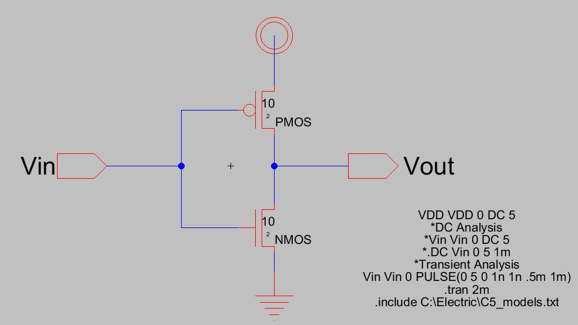
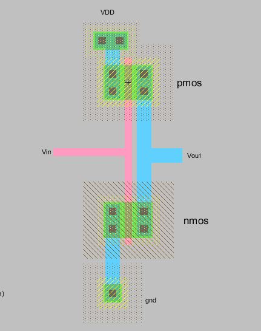
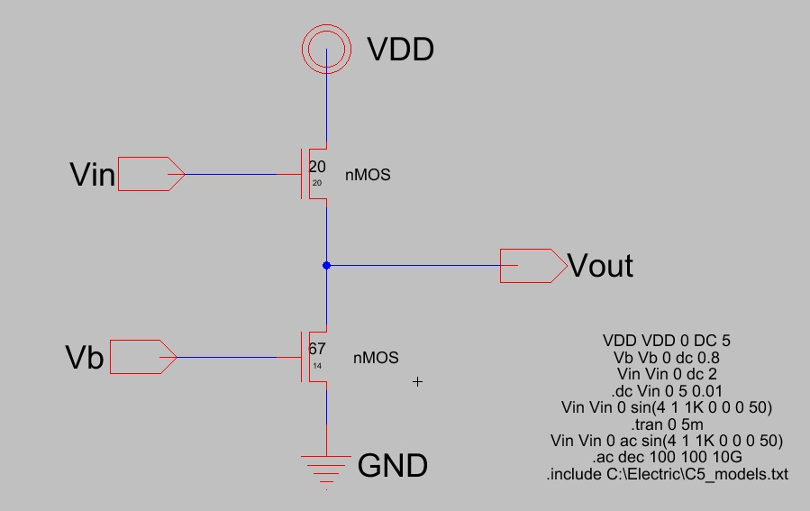
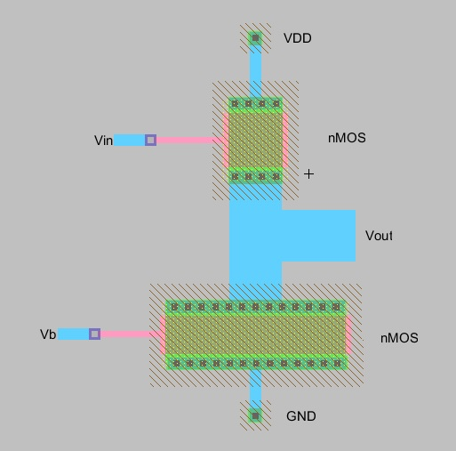
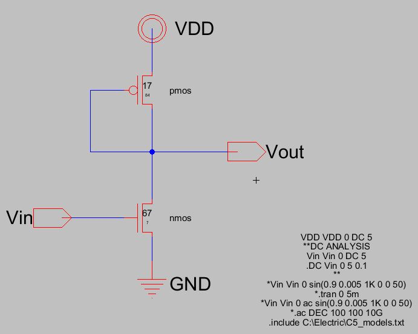
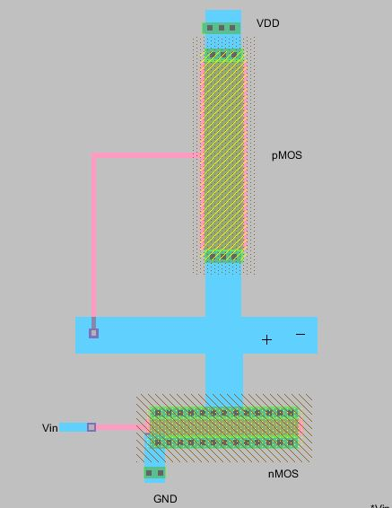
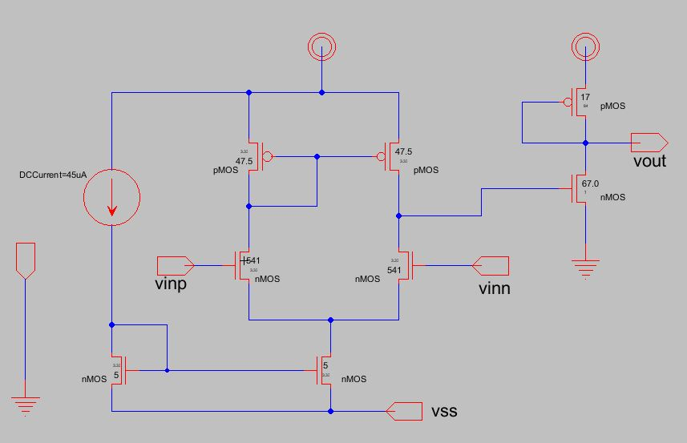
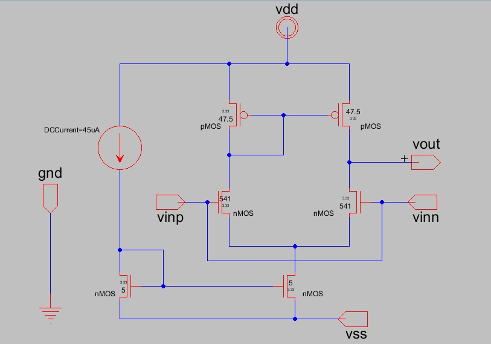
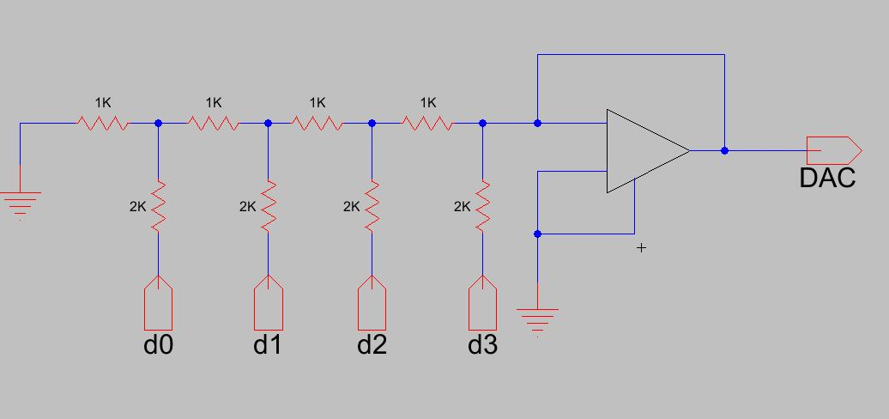
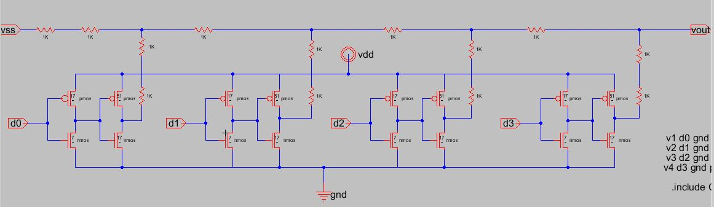

# Verilog codes
https://github.com/hackerminds/7SEM/blob/master/vlsi_codes.md

# Design Files
https://minhaskamal.github.io/DownGit/#/home?url=https://github.com/hackerminds/7SEM/blob/master/VLSI_LAB/Analog_Design.jelib

# Inverter 



 - **PMOS Values**

|Width|Length  |
|--|--|
| 10 | 2 |
 - **NMOS Values**

|Width|Length  |
|--|--|
| 10 | 2 |

 - **Spice Code**

		Vdd Vdd 0 DC 5
		*DC Analysis
		Vin Vin 0 DC 5
		.dc Vin 0 5 1m
		*Transient Analysis
		Vin Vin 0 PULSE(0 5 0 1n 1n .5m 1m)
		.tran 2m
		.include C:\Electric\C5_models.txt

# Common Drain Amplifier



 - **NMOS Values**

|Width|Length  |
|--|--|
| 20 | 20 |
 - **NMOS Values**

|Width|Length  |
|--|--|
| 67 | 14 |

 - **Spice Code**

		Vdd Vdd 0 dc 5
		Vb Vb 0 dc 0.8
		Vin Vin 0 dc 2
		.dc Vin 0 5 0.01 
		Vin Vin 0 sin(4 1 1K 0 0 0 50)
		.tran 0 5m
		Vin Vin 0 ac sin(4 1 1K 0 0 0 50)
		.ac dec 100 100 10G
		.include C:\Electric\C5_models.txt
# Common Source Amplifier


 - **PMOS Values**

|Width|Length  |
|--|--|
| 14 | 84 |
 - **NMOS Values**

|Width|Length  |
|--|--|
| 67 | 4 |

 - **Spice Code**

		Vdd Vdd 0 dc 5
		**DC ANALYSIS
		Vin Vin 0 DC 5
		.dc Vin 0 5 0.1
		**
		Vin Vin 0 sin(0.9 0.005 1K 0 0 50)
		.tran 0 5m
		Vin Vin 0 ac sin(0.9 0.005 1K 0 0 50)
		.ac DEC 100 100 10G
		.include C:\Electric\C5_models.txt
# Operation Amplifier


# - Differential Amplifier	


### PMOS
	 
| Width | Length |
|--|--|
| 47.5 | 3.33 |

### NMOS

| Width | Length |
|--|--|
| 541 | 3.33 |

### - CS-amp at vout
### PMOS
 
| Width | Length |
|--|--|
|  14 | 84 |

### NMOS

| Width | Length |
|--|--|
| 67 | 4 |

 - **Spice Code**

		vdd vdd 0 dc 1.8
		vss vss 0 dc -1.8
		vinp vinp 0 dc 1.8
		.dc vinp -1.8 1.8 0.1
		vinp vinp 0 ac sin(0.7 0.5m 1k)
		vinn vinn 0 dc 0.7
		.tran 0 5m
		vinp vinp 0 ac sin(0.7 0.5m 1k)
		vinn vinn 0 dc 0.7
		.ac dec 100 100 10g
		.include C:\Electric\C5_models.txt

# R2R Ladder



 - **Spice Code**

		vdd vdd 0 dc 5
		vss vss 0 dc -5
		v1 d0 gnd pulse(5 0 0 1n 1n 1m 2m)
		v2 d1 gnd pulse(5 0 0 1n 1n 2m 4m)
		v3 d2 gnd pulse(5 0 0 1n 1n 4m 8m)
		v4 d3 gnd pulse(5 0 0 1n 1n 8m 16m)
	    .tran 32m
	    .include C:\Electric\C5_models.txt

# R2R without opamp


 - **PMOS Values**
		
|Width|Length  |
|--|--|
| 17 | 1 |
| 51 | 1 |

**NMOS Values**

|Width|Length|
|--|--|
| 7 | 1 |
| 17 | 1 |

## SPICE SYNTAX
```boo
Voltage source: 

Vname N1 N2 Type Value

N1 is the positive terminal node
N2 is the negative terminal node
Type can be DC, AC or TRAN, depending on the type of analysis (see Control Statements)
Value gives the value of the source
The name of a voltage and current source must start with V and I, respectively.

Vname N1 N2 PULSE(V1 V2 TD Tr Tf PW Period)
V1 - initial voltage; V2 - peak voltage; TD - initial delay time; Tr - rise time; Tf - fall time; pwf - pulse-wise; and Period - period. 


.AC DEC ND FSTART FSTOP
in which LIN stands for a linear frequency variation, DEC and OCT for a decade and octave variation respectively. NP stands for the number of points and ND and NO for the number of frequency points per decade and octave. FSTART and FSTOP are the start and stopping frequencies in Herz 

.DC SRCname START STOP STEP
in which SRC name is the name of the source you want to vary; START and STOP are the starting and ending value, respectively; and STEP is the size of the increment.
  
.TRAN TSTEP TSTOP <TSTART <TMAX>> <UIC> 
   
TSTEP is the printing increment.
TSTOP is the final time
TSTART is the starting time (if omitted, TSTART is assumed to be zero)
TMAX is the maximum step size.
UIC stands for Use Initial Condition and instructs PSpice not to do the quiescent operating point before beginning the transient analysis. If UIC is specified, PSpice will use the initial conditions specified in the element statements (see data statement) IC = value.
```

 - for more on spice code:
 	http://www.ni.com/tutorial/5420/en/
